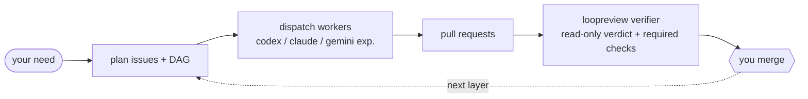

<div align="center">

# loopcoder

**Turn a delivery need into reviewed pull requests -- without leaving the chat.**

[](CHANGELOG.md)
[](LICENSE)
[](SKILL.md)
[](docs/specs/0089-go-migration.md)

[What it is](#what-it-is) | [The loop](#the-loop) | [Install](#install) | [Usage](#usage) | [How it works](#how-it-works) | [Design](#design)

</div>

## What it is

loopcoder is an autonomous delivery loop. Describe what you want shipped in one chat; it plans the work into GitHub issues, dispatches provider-pluggable workers in isolated git worktrees, opens pull requests, runs an independent read-only verifier, and leaves the merge to you.

It kills the copy-paste churn of AI coding: ask the model, paste issues into GitHub, run an agent, review the diff, repeat. With loopcoder that loop runs from the conversation. One chat. No window-switching. You stay the merge authority. Repo-facing artifacts and worker summaries are written in English.

## The loop



The conductor is a configured agent session. The worker defaults to `codex`;
`codex` and `claude` are the verified worker providers for v0.3.0. The
`gemini` worker adapter is present and registered, but experimental and
unverified end-to-end because the Gemini CLI was not usable in the development
environment. The verifier is configured separately and should normally differ
from the worker. The gate is always you.

## What it looks like

Illustrative:

```text
you   > /loopcoder add a /healthz endpoint and a test, behind a feature flag
loop  > plan: #41 endpoint, #42 test (blocked-by #41). dispatch the ready set? [y]
loop  > #41 -> worktree -> codex -> PR #43   checks green   verdict: pass
loop  > #41 merged; #42 ready -> PR #44   verdict: pass
loop  > done. 2 PRs, you merged both, 0 blocked.
```

## Install

```bash
go install github.com/jasonhnd/loopcoder/cmd/loopcoder@latest
```

Prerequisites on `PATH`: `git`, `gh` (authenticated), and at least one supported provider CLI. `codex` is the default worker, `claude` is a verified worker provider, and `gemini` is an experimental/unverified worker adapter.

Cross-platform: macOS, Linux, and Windows -- a single Go binary, no PowerShell. loopcoder is also usable as a Claude Code skill; point the `loopcoder` skill at this repo.

## Usage

- In a conductor session: `/loopcoder <your need>` -- the conductor plans, dispatches, verifies, and reports; you name what to merge.
- The mechanical layer is the `loopcoder` binary. The conductor calls it; you can too:

```bash
loopcoder ready-set     --repo .                  # classify ready vs blocked work
loopcoder dispatch-wave --repo .                  # dispatch the current ready wave
loopcoder dispatch      --repo . --issue-number 41 --issue-title "Add /healthz endpoint" --provider claude
loopcoder resume        --repo .                  # reconcile a run after an interruption
loopcoder recover       --repo . --issue-number 41 --issue-title "Add /healthz endpoint" --run-id <id>   # bounded retry of a failed attempt
loopcoder loopreview    --repo . --pr-number 43 --provider claude   # read-only independent verifier
loopcoder verify-local  --repo . --pr-number 43   # run a repo's local check commands on a PR
```

## How it works

- Conductor: a configured agent session. It plans issues, dispatches workers, folds verification results into status, and reports progress. It never writes the code itself.
- Worker: `loopcoder dispatch` runs one registered provider for one issue in a fresh, isolated git worktree, then opens a PR. The verified worker providers are `codex` (default) and `claude`; `gemini` is registered but experimental/unverified.
- Verifier: `loopcoder loopreview` checks a PR branch in a read-only worktree and returns a structured `pass`, `fail`, or `needs-human` verdict with findings, evidence, and spec-conformance status when the verifier completes. Its timeout safety net works: a slow or hung verifier degrades to `needs-human`. In v0.3.0, LLM verifier provider reliability is experimental; a real `claude` verifier run can stall and time out, and `gemini` verification is unverified.
- Gate: you merge. loopcoder never auto-merges.
- Ports and adapters: GitHub work items, git-worktree workspace, configured conductor, provider-pluggable worker, GitHub PRs and checks, independent verifier, human-merge gate. `.delivery.yml adapters` names the role slots, including `conductor`, `worker`, and `verifier`; `verifier == worker` is advisory-only but should be avoided for author-bias reduction.
- Doc-first: a design or spec document merges before any code implements it. See [`docs/PROCESS.md`](docs/PROCESS.md).
- Cross-platform: one Go binary; providers run through native adapters, and worktree creation is serialized with a cross-platform file lock.

## Why loopcoder

- You always merge -- explicit human gate, never auto-merge.
- Isolated git worktrees -- parallel workers do not collide; conflicts are handled at merge time.
- Doc-first -- code implements a merged design, and review checks conformance to it.
- Verification gate wiring -- required CI checks must be green before a PR is merge-eligible; `loopreview` adds read-only verifier output and a timeout-to-`needs-human` safety net, while reliable LLM verifier provider validation remains a follow-up.
- Cross-platform native binary -- `go install`, no runtime dependency beyond `git`, `gh`, and the selected provider CLIs.
- Self-hosting -- loopcoder planned, dispatched, reviewed, and merged most of its own development, including its v0.2.0 rewrite from PowerShell to Go and its v0.3.0 multi-provider worker layer.

## Design

- [`docs/README.md`](docs/README.md) -- document type legend and docs index.
- [`docs/PROCESS.md`](docs/PROCESS.md) -- mandatory doc-first workflow.
- [`docs/reference/architecture.md`](docs/reference/architecture.md) -- current architecture and limits.
- [`docs/specs/0028-scheduling.md`](docs/specs/0028-scheduling.md) -- dependency-aware scheduling.
- [`docs/specs/0039-verification.md`](docs/specs/0039-verification.md) -- required checks and verifier verdicts.
- [`docs/specs/0040-self-improvement.md`](docs/specs/0040-self-improvement.md) -- bounded, human-gated learning loop.
- [`docs/specs/0041-resilience.md`](docs/specs/0041-resilience.md) -- worker state, resume, recovery, and retry.
- [`docs/specs/0081-orchestration.md`](docs/specs/0081-orchestration.md) -- ready-set and dispatch-wave orchestration.
- [`docs/specs/0089-go-migration.md`](docs/specs/0089-go-migration.md) -- native Go backend migration.
- [`docs/reference/usage.md`](docs/reference/usage.md) -- setup and end-to-end usage.
- [`docs/learnings.md`](docs/learnings.md) -- append-only operational learnings.
- [`CHANGELOG.md`](CHANGELOG.md) -- release history.

## Status

v0.3.0 is the current cross-platform native Go CLI: provider-pluggable workers (`codex` and `claude` verified; `gemini` experimental/unverified), independent `loopreview` command with a timeout safety net, `.delivery.yml` role slots, human-merge gate, doc-first workflow, and real self-hosting. Reliable LLM verifier provider validation is a v0.3.1 follow-up, and a background or cloud conductor tick remains a documented target rather than current behavior.

## License

[MIT](LICENSE)
