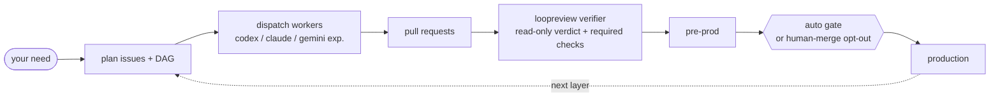

<div align="center">

# loopcoder

**Turn a delivery need into reviewed pull requests -- without leaving the chat.**

[](CHANGELOG.md)
[](LICENSE)
[](SKILL.md)
[](docs/specs/0089-go-migration.md)

[What it is](#what-it-is) | [The loop](#the-loop) | [Install](#install) | [Usage](#usage) | [How it works](#how-it-works) | [Design](#design)

</div>

## What it is

loopcoder is an autonomous delivery loop. Describe what you want shipped in one chat; it plans the work into GitHub issues, dispatches provider-pluggable workers in isolated git worktrees, opens pull requests, runs an independent read-only verifier, and auto-promotes qualifying work to production by default.

It kills the copy-paste churn of AI coding: ask the model, paste issues into GitHub, run an agent, review the diff, repeat. With loopcoder that loop runs from the conversation. One chat. No window-switching. Set `adapters.gate: human-merge` when you want humans to choose production merges explicitly. Repo-facing artifacts and worker summaries are written in English.

## The loop



The conductor is a configured agent session. The worker defaults to `codex`;
`codex` and `claude` are the verified worker providers. The
`gemini` worker adapter is present and registered, but experimental and
unverified end-to-end because the Gemini CLI was not usable in the development
environment. The verifier is configured separately and should normally differ
from the worker. The production promotion gate defaults to `auto`; set
`adapters.gate: human-merge` to opt out.

## What it looks like

Illustrative:

```text
you   > /loopcoder add a /healthz endpoint and a test, behind a feature flag
loop  > plan: #41 endpoint, #42 test (blocked-by #41). dispatch the ready set? [y]
loop  > #41 -> worktree -> codex -> PR #43   checks green   verdict: pass
loop  > #41 merged; #42 ready -> PR #44   verdict: pass
loop  > done. 2 PRs promoted, 0 blocked.
```

## Install

Install from GitHub Releases with the no-Go scripts:

```bash
curl -fsSL https://raw.githubusercontent.com/jasonhnd/loopcoder/main/scripts/install.sh | sh
```

```powershell
irm https://raw.githubusercontent.com/jasonhnd/loopcoder/main/scripts/install.ps1 | iex
```

Or install with Go:

```bash
go install github.com/jasonhnd/loopcoder/cmd/loopcoder@latest
```

Then confirm the binary:

```bash
loopcoder --version
```

For a first consumer repository, follow the
[`Quickstart (new project)`](docs/reference/usage.md#quickstart-new-project):
install once, run `loopcoder --version` and `loopcoder doctor`, run
`loopcoder init` in each repo, install the playbook and project conductor hooks
with `loopcoder skill install --repo <repo>`, then drive
`/loopcoder <your need>`.

Prerequisites on `PATH`: `git`, `gh` (authenticated), and at least one supported provider CLI. `codex` is the default worker, `codex` and `claude` are verified verifier providers, `claude` is also a verified worker provider, and `gemini` is experimental/unverified.

Cross-platform: macOS, Linux, and Windows -- a single Go binary, no PowerShell. See [`docs/reference/usage.md`](docs/reference/usage.md) for setup and end-to-end usage. loopcoder is also usable as a Claude Code skill; point the `loopcoder` skill at this repo.

## Usage

- In a conductor session: `/loopcoder <your need>` -- the conductor plans, dispatches, verifies, and reports; production promotion is automatic by default when the gate passes, with `human-merge` available as an explicit opt-out.
- The mechanical layer is the `loopcoder` binary. The conductor calls it; you can too:

```bash
loopcoder ready-set     --repo .                  # classify ready vs blocked work
loopcoder dispatch-wave --repo .                  # dispatch the current ready wave
loopcoder dispatch      --repo . --issue-number 41 --issue-title "Add /healthz endpoint" --provider claude
loopcoder resume        --repo .                  # reconcile a run after an interruption
loopcoder status        --repo .                  # render local-only run status
loopcoder relay list    --repo .                  # inspect pending local relay blocks
loopcoder relay flush   --repo .                  # print pending relay blocks verbatim and clear them
loopcoder recover       --repo . --issue-number 41 --issue-title "Add /healthz endpoint" --run-id <id>   # bounded retry of a failed attempt
loopcoder loopreview    --repo . --pr-number 43 --provider claude   # read-only independent verifier
loopcoder verify-local  --repo . --pr-number 43   # run a repo's local check commands on a PR
loopcoder audit         --repo . --layer sast      # deterministic read-only security audit floor
loopcoder attest        --role conductor --provider codex-cli --model gpt-5 --permission orchestrate --action "dispatch issue #41" --duration-ms 120000 --total-tokens 12345
```

`dispatch` and `loopreview` emit local-only human-readable pretty attestation
blocks to stderr by default, while foreground `dispatch-wave` streams each
Worker pretty block to stdout as that Worker completes and still prints the
aggregate wave report. The durable local machine surfaces are the `dispatch` /
`loopreview` result JSON and gitignored `.loopcoder/` run records, not PR
bodies or merge artifacts. Use `--pretty` to force emoji output and
`--no-pretty` to suppress the display; `attest --pretty` remains the direct
human-readable Conductor self-attestation form.

### loopreview exit codes and relay gate

`loopcoder loopreview` reserves process exit codes `0`, `1`, and `2` for clean
verifier verdicts only, so CI can distinguish a review decision from a command
failure:

- `0` means clean verifier verdict `pass`.
- `1` means clean verifier verdict `fail`.
- `2` means clean verifier verdict `needs-human`.
- `3` means the `loopreview` command itself failed before or after a clean
  verdict, such as invalid flags, a bad `--repo`, configuration load failure,
  provider/git setup failure, or output/relay write failure.
- `4` is reserved for the cross-command relay hard gate on mechanical progress
  commands: a pending local-only Worker/Verifier pretty block must be surfaced
  with `loopcoder relay flush --repo <path>` before the command can run.

The `relay` command group is the recovery and inspection surface:
`loopcoder relay flush --repo <path>` prints pending blocks verbatim to stdout
and clears them, while `loopcoder relay list --repo <path>` lists pending
records without acknowledging them.

`loopcoder status` renders delivery status from local `.loopcoder/` run state.
Installed conductor hooks enforce the local flow: `conductor-relay-guard`
prevents hidden `dispatch`, `dispatch-wave`, or `loopreview` attestation blocks
from completing a turn, including PowerShell/pwsh and backgrounded command
output, and `conductor-attest` requires a Conductor self-attestation before a
delivery or merge turn finishes. Install them into project
`.claude/settings.json` with `loopcoder skill install --repo <repo>`;
`loopcoder doctor` warns when they are missing.

## How it works

- Conductor: a configured agent session. It plans issues, dispatches workers, folds verification results into `loopcoder status`, and reports progress. It never writes the code itself.
- Worker: `loopcoder dispatch` runs one registered provider for one issue in a fresh, isolated git worktree, then opens a PR. The verified worker providers are `codex` (default) and `claude`; `gemini` is registered but experimental/unverified.
- Verifier: `loopcoder loopreview` checks a PR branch in a read-only worktree and returns a structured `pass`, `fail`, or `needs-human` verdict with findings, evidence, and spec-conformance status when the verifier completes. Its bounded review packet, timeout safety net, and provider attestation are verified for `codex` and `claude`; a slow, hung, malformed, or incomplete verifier still degrades to `needs-human`. `gemini` verification remains unverified.
- Gate: clean `tick` PRs can auto-merge only into the configured pre-prod branch after `loopreview = pass`, green required checks, and a deterministic red-line risk gate. The separate `promote` step defaults to `gate: auto`, which auto-promotes to production only when CI is green, `loopreview` passed, configured evidence is present, and the red-line floor is clean; production auto-rollback deterministically reverts to the recorded prior-stable SHA if post-promote checks fail.
- Ports and adapters: GitHub work items, git-worktree workspace, configured conductor, provider-pluggable worker, GitHub PRs and checks, independent verifier, pre-prod risk gate, and production promotion gate. `.delivery.yml adapters` names the role slots, including `conductor`, `worker`, `verifier`, and `gate`; `gate: human-merge` is the explicit opt-out from default auto promotion, and `verifier == worker` is advisory-only but should be avoided for author-bias reduction.
- Doc-first: a design or spec document merges before any code implements it. See [`docs/PROCESS.md`](docs/PROCESS.md).
- Cross-platform: one Go binary; providers run through native adapters, and worktree creation is serialized with a cross-platform file lock.

## Why loopcoder

- Production promotion defaults to `auto`, with a deterministic conjunctive gate, production rollback to the recorded prior-stable SHA, and `human-merge` as the explicit opt-out.
- Isolated git worktrees -- parallel workers do not collide; conflicts are handled at merge time.
- Doc-first -- code implements a merged design, and review checks conformance to it.
- Verification gate wiring -- required CI checks must be green before a PR is merge-eligible; `loopreview` adds read-only verifier output and a timeout-to-`needs-human` safety net, with `codex` and `claude` provider verification proven by real smoke runs.
- Audit -- `loopcoder audit` provides a read-only security audit with a deterministic SAST floor for CI and an optional read-only LLM review lens for local adversarial analysis. Thresholds, SAST commands, rubrics, and baselines are configured under `.delivery.yml audit`; Layer 2 attestation remains local-only. See [`docs/reference/audit.md`](docs/reference/audit.md).
- Attestation -- worker and verifier invocations produce validated local-only records with `verified: true` covering provider, real parsed model, effort, permission, duration, and token usage. `dispatch` and `loopreview` emit human-readable pretty attestation blocks to stderr by default; `dispatch-wave` streams each Worker pretty block to stdout as that Worker completes. The durable local machine surfaces are the `dispatch` / `loopreview` result JSON and gitignored `.loopcoder/` run records. PR bodies, merge commits, and merge comments do not carry attestation headers or canonical JSON. The display shows provider vendor plus CLI tool, detected/self-reported model source, host-local timestamps, seconds duration, and grouped token counts. `--pretty` forces emoji and `--no-pretty` suppresses the display. `loopcoder attest` emits Conductor self-attestation (`model_source: self-reported`, `verified: false`). The relay hard gate blocks mechanical progress with exit code `4` while pending Worker/Verifier blocks are unacknowledged; `loopcoder relay flush` prints and clears them, and `loopcoder relay list` inspects them. The `conductor-relay-guard` and `conductor-attest` hooks keep relay and self-attestation obligations on local visible surfaces. Missing required identity or usage fails closed: dispatch opens no PR, `loopreview` returns `needs-human`, and `loopcoder attest` exits non-zero. The attestation layer is verified end-to-end on `codex` and `claude`. See [`docs/specs/0146-attestation.md`](docs/specs/0146-attestation.md), [`docs/specs/0214-human-readable-attestation.md`](docs/specs/0214-human-readable-attestation.md), [`docs/specs/0282-default-pretty-attestation.md`](docs/specs/0282-default-pretty-attestation.md), [`docs/specs/0306-local-only-attestation.md`](docs/specs/0306-local-only-attestation.md), [`docs/specs/0316-conductor-local-enforcement.md`](docs/specs/0316-conductor-local-enforcement.md), and [`docs/specs/0447-relay-enforcement-hardgate.md`](docs/specs/0447-relay-enforcement-hardgate.md).
- Cross-platform native binary -- `go install`, no runtime dependency beyond `git`, `gh`, and the selected provider CLIs.
- Self-hosting -- loopcoder planned, dispatched, reviewed, and merged most of its own development, including the rewrite from PowerShell to Go, multi-provider workers, attestation, delivery guardrails, loopreview reliability hardening, default-on pretty attestation relay, skill propagation, attestation display polish, honest model attribution, verifier model pin, the local-only attestation contract, and conductor local enforcement.

## Design

- [`docs/README.md`](docs/README.md) -- document type legend and docs index.
- [`docs/PROCESS.md`](docs/PROCESS.md) -- mandatory doc-first workflow.
- [`docs/reference/architecture.md`](docs/reference/architecture.md) -- current architecture and limits.
- [`docs/reference/audit.md`](docs/reference/audit.md) -- read-only security audit command.
- [`docs/specs/0028-scheduling.md`](docs/specs/0028-scheduling.md) -- dependency-aware scheduling.
- [`docs/specs/0039-verification.md`](docs/specs/0039-verification.md) -- required checks and verifier verdicts.
- [`docs/specs/0040-self-improvement.md`](docs/specs/0040-self-improvement.md) -- bounded, human-gated learning loop.
- [`docs/specs/0041-resilience.md`](docs/specs/0041-resilience.md) -- worker state, resume, recovery, and retry.
- [`docs/specs/0081-orchestration.md`](docs/specs/0081-orchestration.md) -- ready-set and dispatch-wave orchestration.
- [`docs/specs/0089-go-migration.md`](docs/specs/0089-go-migration.md) -- native Go backend migration.
- [`docs/specs/0146-attestation.md`](docs/specs/0146-attestation.md) -- per-invocation Worker, Verifier, and Conductor attestation.
- [`docs/reference/usage.md`](docs/reference/usage.md) -- setup and end-to-end usage.
- [`docs/learnings.md`](docs/learnings.md) -- append-only operational learnings.
- [`CHANGELOG.md`](CHANGELOG.md) -- release history.

## Status

v0.4.2 is the current cross-platform native Go CLI. It is an operational-reliability hardening release per [`docs/specs/0423-operational-reliability-hardening.md`](docs/specs/0423-operational-reliability-hardening.md), [`docs/specs/0447-relay-enforcement-hardgate.md`](docs/specs/0447-relay-enforcement-hardgate.md), #407, and #447: hung/stalled workers harvest committable work before discard (H1), worker/verifier liveness includes worktree-mtime progress with raised watchdog windows (H2), `loopreview` builds source-first review packets before generated/large diffs (H3), config resolution fails loud when `.delivery.yml` exists on the base branch but not the working tree and supports `--config-from-base` (H4), `loopreview` reserves exit codes `0`/`1`/`2` for clean verdicts while command failures exit `3` (H5), and pending Worker/Verifier relay blocks hard-gate mechanical progress with exit code `4` until `loopcoder relay flush` surfaces and clears them. It retains provider-pluggable workers (`codex` and `claude` verified; `gemini` experimental/unverified), opt-in delivery guardrails, independent `loopreview`, `.delivery.yml` role slots including a pinned Claude verifier model and effort, default-on `auto` production promotion with `human-merge` opt-out, doc-first workflow, real self-hosting, and per-invocation Worker, Verifier, and Conductor attestation. Worker and Verifier records are validated local-only records; `dispatch` and `loopreview` emit pretty attestation blocks to stderr, foreground `dispatch-wave` streams Worker pretty blocks to stdout as each Worker completes, and durable machine evidence lives in `dispatch` / `loopreview` result JSON plus gitignored `.loopcoder/` run records. PR bodies and merge artifacts have zero attestation footprint. Conductor local enforcement includes the `conductor-relay-guard` and `conductor-attest` hooks -- invoked as `loopcoder hook <name>` embedded in the binary so they resolve in any repo -- plus PowerShell/pwsh and background relay coverage, `loopcoder status`, install-time hook wiring, and doctor warnings for missing hooks. The LLM review verdict itself remains non-deterministic, and `gemini` verifier validation remains a documented target rather than current behavior. loopcoder's own repository remains explicitly configured with `gate: human-merge` for self-hosting safety.

## License

[MIT](LICENSE)
