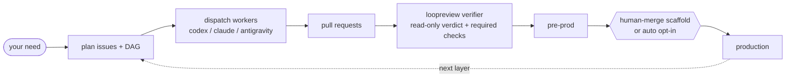

<div align="center">

# loopcoder

**Turn a delivery need into reviewed pull requests -- without leaving the chat.**

[](CHANGELOG.md)
[](LICENSE)
[](SKILL.md)
[](docs/specs/0089-go-migration.md)

[What it is](#what-it-is) | [The loop](#the-loop) | [Install](#install) | [Usage](#usage) | [Upgrade](#upgrade-from-061-to-070) | [How it works](#how-it-works) | [Design](#design)

</div>

## What it is

loopcoder is an autonomous delivery loop. Describe what you want shipped in one chat; it plans the work into GitHub issues, dispatches provider-pluggable workers in isolated git worktrees, opens pull requests, runs an independent read-only verifier, and can automatically promote qualifying work when the production gate is configured for `auto`.

It removes the copy-paste churn of AI coding: ask the model, paste issues into GitHub, run an agent, review the diff, repeat. With loopcoder that loop runs from the conversation. One chat. No window-switching. New scaffolds write `adapters.gate: human-merge` so humans choose production merges explicitly; legacy empty or missing gate configs still normalize to `auto` at runtime for compatibility. Repo-facing artifacts and worker summaries are written in English.

v0.7.0 is the current customer install target. It packages machine-local runtime storage, the project registry, explicit v0.6.x local-state migration, nested run-tree observability, provider/host compatibility diagnostics, signed release smoke, role-scoped model/depth discovery, the Google Antigravity `agy` provider path, reporter output, first-run `init --repo/--gate`, machine-readable `doctor`, local-state protection, and richer `report` records into the published release.

## The loop



The conductor is a configured agent session. The worker defaults to `codex`; `codex` and `claude` are verified worker providers, and `antigravity` is the Google Antigravity CLI path through executable `agy`. The older direct `gemini` adapter remains experimental and outside the static model registry. The verifier is configured separately and should normally differ from the worker. At runtime, an empty or missing production gate normalizes to `auto` for legacy compatibility. New `loopcoder init --repo .` scaffolds write `adapters.gate: human-merge`; pass `--gate auto` or edit `.delivery.yml` to opt into automatic production promotion.

## What it looks like

Illustrative:

```text
you   > /loopcoder add a /healthz endpoint and a test, behind a feature flag
loop  > plan: #41 endpoint, #42 test (blocked-by #41). dispatch the ready set? [y]
loop  > #41 -> worktree -> codex -> PR #43   checks green   verdict: pass
loop  > #41 merged; #42 ready -> PR #44   verdict: pass
loop  > done. 2 PRs promoted, 0 blocked.
```

## Install

Install v0.7.0 from GitHub Releases with the no-Go scripts:

```bash
curl -fsSL https://raw.githubusercontent.com/jasonhnd/loopcoder/main/scripts/install.sh | sh -s -- --version 0.7.0
```

```powershell
$env:LOOPCODER_VERSION = "0.7.0"
irm https://raw.githubusercontent.com/jasonhnd/loopcoder/main/scripts/install.ps1 | iex
```

Or install with Go:

```bash
go install github.com/jasonhnd/loopcoder/cmd/loopcoder@v0.7.0
```

Then confirm the binary:

```bash
loopcoder version
```

For a first consumer repository, follow the [`Quickstart (new project)`](docs/reference/usage.md#quickstart-new-project): install once, run `loopcoder version`, run `loopcoder init --repo .`, install the playbook and project conductor hooks with `loopcoder skill install --repo .`, run `loopcoder doctor --repo .`, run `loopcoder report --repo .`, then drive dispatch, `tick`, and `loopreview` through `/loopcoder <your need>`.

Prerequisites on `PATH`: `git`, authenticated `gh`, and at least one supported provider CLI. The release install scripts verify signed `SHA256SUMS` before trusting checksums, using cosign on the script path. `codex` is the default worker; `codex` and `claude` are verified worker and verifier providers; `antigravity` uses executable `agy`; the direct `gemini` adapter is still experimental/unverified.

Cross-platform: macOS, Linux, and Windows -- a single Go binary, no PowerShell runtime. See [`docs/reference/usage.md`](docs/reference/usage.md) for setup and end-to-end usage. loopcoder is also usable as a Claude Code skill; point the `loopcoder` skill at this repo.

## Upgrade From 0.6.1 To 0.7.0

Upgrade from the v0.6.1 bridge to v0.7.0, then refresh each project's hooks, register the checkout, inspect the local-state migration dry run, and run doctor:

```text
loopcoder upgrade --version 0.7.0
loopcoder version
loopcoder skill install --repo .
loopcoder projects register --repo .
loopcoder migrate local-state --repo . --dry-run
loopcoder doctor --repo .
```

`loopcoder upgrade --version 0.7.0` selects the machine-level binary from GitHub Releases, verifies signed checksums, swaps the selected binary atomically or stages the Windows deferred replacement, and refreshes the global bundled skill. Each project must still run `loopcoder skill install --repo <repo>` to write or refresh project hook settings, `.loopcoder/conductor-workspace`, and local `.git/info/exclude` protection for `.loopcoder/`. `loopcoder projects register --repo <repo>` records the checkout in the machine-local project registry. `loopcoder migrate local-state --repo <repo> --dry-run` previews compatible v0.6.x repo-local `.loopcoder/` imports; run the non-dry-run migration only after reviewing the copied record set. `loopcoder doctor --repo <repo>` is the read-only readiness check; `doctor --fix` remains an explicit local repair/cleanup mode, not a first-run requirement.

Environment variables cannot be edited by loopcoder. If doctor reports old `LOOPCODER_CONDUCTOR_ATTEST_SCOPE` or `LOOPCODER_CONDUCTOR_ATTEST_STATE_DIR`, move those shell settings to `LOOPCODER_CONDUCTOR_REPORTER_SCOPE` or `LOOPCODER_CONDUCTOR_REPORTER_STATE_DIR` yourself and reopen the shell. Re-running `loopcoder upgrade --version 0.7.0` after selecting v0.7.0 should report that the selected binary is already latest. If you are still on v0.5.4 or older 0.5.x releases, upgrade through the v0.6.1 bridge before selecting v0.7.0.

## Usage

- In a conductor session: `/loopcoder <your need>` -- the conductor plans, dispatches, verifies, and reports; production promotion follows `adapters.gate`. New scaffolds are human-directed by default, while legacy gate-less configs and explicit `gate: auto` configs use automatic production promotion when the gate passes.
- The mechanical layer is the `loopcoder` binary. The conductor calls it; you can too. The stable command inventory below matches the v0.7.0 install commands in this README:

```bash
loopcoder version                             # print version and build information
loopcoder models                              # list provider model/depth registry
loopcoder models --provider antigravity       # list agy-backed model choices
loopcoder providers refresh --repo .          # refresh bounded provider CLI installation inventory
loopcoder audit --repo . --layer sast         # run read-only security audit
loopcoder doctor --repo .                     # read-only readiness and migration report
loopcoder doctor --repo . --format json       # machine-readable readiness report
loopcoder doctor --repo . --fix               # explicit local repair/cleanup mode
loopcoder init --repo .                       # scaffold first-run repo files with human-merge gate
loopcoder init --repo . --gate auto           # explicitly opt into automatic production promotion
loopcoder skill install --repo .              # install global skill and project hooks
loopcoder discover --repo .                   # advanced: discover CI failures and file issues
loopcoder compile --repo .                    # advanced: compile ROADMAP.md into issues
loopcoder ready-set     --repo .              # classify ready vs blocked work
loopcoder tick          --repo .              # run one unattended delivery pass
loopcoder trigger goal-loop --repo .          # advanced: run an automation trigger
loopcoder promote      --repo .               # may change production branch when gates pass
loopcoder upgrade --version 0.7.0             # signed self-upgrade from GitHub Releases
loopcoder dispatch-wave --repo .              # dispatch the current ready wave
loopcoder dispatch      --repo . --issue-number 41 --issue-title "Add /healthz endpoint" --provider claude --strict
loopcoder relay list    --repo .              # inspect pending local relay blocks
loopcoder relay flush   --repo .              # print pending relay blocks verbatim and clear them
loopcoder resume        --repo .              # reconcile a run after an interruption
loopcoder status        --repo .              # render local-only run status
loopcoder report        --repo .              # list recent local reporter records
loopcoder report --repo . --format json       # list reports plus records/source/run/path context
loopcoder state push    --repo . --run-id <id> # explicitly publish summaries to the state branch
loopcoder state pull    --repo .              # pull state branch summaries
loopcoder lease acquire --repo . --run-id <id> # acquire conductor lease
loopcoder lease release --repo . --run-id <id> # release conductor lease
loopcoder recover       --repo . --issue-number 41 --issue-title "Add /healthz endpoint" --run-id <id>
loopcoder loopreview    --repo . --pr-number 43 --provider claude --strict
loopcoder verify-local  --repo . --pr-number 43
loopcoder dispatch-wave --repo . --issue-numbers 41,42
loopcoder hook conductor-reporter             # internal: host hook integration
loopcoder ps --repo .                         # list loopcoder-managed worker processes
loopcoder kill --repo . --run <run-id>        # terminate loopcoder-managed processes for one run
loopcoder kill --repo . --all                 # terminate all loopcoder-managed processes for this repo
loopcoder attest        --role conductor --provider codex-cli --model gpt-5 --permission orchestrate --action "dispatch issue #41" --duration-ms 120000 --total-tokens 12345
```

v0.7.0 adds the following commands and output fields:

```bash
loopcoder projects register --repo .          # add or refresh this checkout in the global project registry
loopcoder projects list --format json         # list registered projects for machine use
loopcoder projects show --repo .              # inspect this checkout's resolved registry identity
loopcoder projects remove --repo .            # detach active registry entry while preserving history
loopcoder migrate local-state --repo . --dry-run
loopcoder migrate local-state --repo .        # copy legacy .loopcoder records into local storage
loopcoder nested run --repo . --plan child-plan.json --provider codex # execute a validated child plan
loopcoder status --repo . --format json       # inspect latest run tree as stable JSON
loopcoder report --repo . --run <id> --format json # include run_tree in JSON
```

`dispatch` and `loopreview` emit local-only human-readable report receipts to stderr by default, while foreground `dispatch-wave` streams each Worker receipt to stdout as that Worker completes and still prints the aggregate wave report. Receipts are conclusion-first and use the stable section order `Target`, `Verdict`, `Review summary`, `Run`, and `Next`; verifier receipts include verdict, finding counts, and needs-human reasons. The durable local machine surfaces are the `[reporter]` header, canonical report JSON, the `dispatch` / `loopreview` result JSON, and gitignored `.loopcoder/` run records, not PR bodies or merge artifacts. Use `--pretty` to force emoji output and `--no-pretty` to suppress the display. `loopcoder attest` remains a compatibility alias for direct Conductor self-reports.

### Model And Depth

`loopcoder models` prints the static provider registry without reading `.delivery.yml`, calling provider CLIs, or requiring provider authentication:

```text
loopcoder models
loopcoder models --provider codex
loopcoder models --provider claude
loopcoder models --provider antigravity
loopcoder providers refresh --repo .
```

Initial registry defaults:

| Provider | CLI | Default model | Default depth |
| --- | --- | --- | --- |
| `codex` | `codex` | `gpt-5.5` | `high` |
| `claude` | `claude` | `claude-opus-4-8[1m]` | `max` |
| `antigravity` | `agy` | `Gemini 3.1 Pro` | `High` |

Worker and Verifier model selection is role-scoped. For each role, provider resolves from command flags, then `.delivery.yml`, then built-in role fallback. Model resolves from command flags, then `worker.model` / `verifier.model`, then the selected provider's registry default. Depth resolves from command `--effort`, then `worker.reasoning_effort` / `verifier.reasoning_effort`, then the selected model's default depth.

Configured model and depth values are exact and case-sensitive. Invalid selections warn by default and preserve the pass-through value for compatibility. Enable hard rejection with:

```yaml
models:
  strict: true
```

or pass `--strict` to commands that resolve Worker or Verifier model/depth selections, including `dispatch`, `dispatch-wave`, `loopreview`, `audit`, `tick`, `trigger`, and `recover`.

### Antigravity

The provider key is `antigravity`; the executable is `agy`.

```text
agy login
agy models
loopcoder models --provider antigravity
loopcoder providers refresh --repo .
loopcoder doctor --repo .
```

When configured as a Worker provider, loopcoder invokes:

```text
agy -p <prompt> --add-dir <worktree> --model "<model> (<Depth>)"
```

The mandatory `--add-dir` pins Antigravity to the worker worktree. Antigravity Worker reports use the selected model string, such as `Gemini 3.1 Pro (High)`, as `model_source: self-reported` and accept absent token usage because `agy` does not expose stable parseable usage in this path. Antigravity read-only mode is not available or verified, so `loopreview` and audit-review selections fail closed instead of launching a mutating review.

### Doctor And Migration Preview

The current v0.7.0 `loopcoder doctor --repo .` is a read-only operational
health command for git, gh auth, `.delivery.yml`, provider CLIs, selected
binary version, reporter/relay wiring, installed skill freshness, audit
readiness, local-state exclude protection, tracked `.loopcoder/` files,
reportquery readability, and stale local state counts.

v0.7.0 expands `doctor` with resolved host profile, provider/host
compatibility, storage permissions, storage health, project registry identity,
and migration status. `--format json` emits
`repo_path`, `version`, `commit`, `date`, `exit_code`, a root `host_profile`
object, `provider_compatibility[]` entries for the smoke matrix, a root
`provider_inventory` object, and ordered `checks[]` objects with `name`,
`code`, `status`, `hard`, `message`, and `fix_command`.

`loopcoder providers refresh --repo .` runs the same bounded provider CLI
installation probes and persists machine-local ProviderInstallation and
ProbeResult history in `$LOOPCODER_HOME/data/loopcoder.db`. Probes use fixed
argv arrays, an explicit non-credential environment allowlist, strict
time/output caps, redacted provider output, and no shell interpolation.
The allowlist includes location and platform variables needed by script shims
such as `LOCALAPPDATA`, `APPDATA`, `ProgramFiles`, `SystemRoot`, `ComSpec`,
`PSModulePath`, `PATH`, `PATHEXT`, `TEMP`, `TMP`, `HOME`, `USERPROFILE`,
`TMPDIR`, `LANG`, and `LC_ALL`; any variable name containing `key`, `secret`,
`token`, `password`, `credential`, or `auth` is still denied even if listed.
Installation evidence is not auth readiness, account readiness, model
authorization, quota, or usable capacity; human and JSON output keep
`usable_for_invocation` as `unknown` from install evidence alone.

v0.8 provider inventory also records credential-blind `account_profiles` and
`auth_readiness` entries. Built-in readiness probes use only adapter-declared
read-only status surfaces: `codex login status`, `claude auth status --json`,
`agy models`, or declared Gemini secret-reference existence when no safe status
command is available. Readiness states are `ready`, `not-authenticated`,
`expired`, and `unknown`; `unknown` is preserved instead of being coerced to
success or failure. LoopCoder never reads credential file contents or
environment variable values for these records, and it persists only redacted
profile labels, opaque profile IDs, hashes of non-secret references, probe
metadata, and bounded redacted command summaries. If a project must pin a
specific discovered profile, use the collision-safe ID:

```yaml
provider_inventory:
  profile_overrides:
    claude: acct_exampleprofileid
```

### Project Registry

`loopcoder projects` manages the v0.7.0 machine-local project registry in `$LOOPCODER_HOME/data/loopcoder.db`. On Unix-like systems, loopcoder creates and tightens `$LOOPCODER_HOME` and `data/` to owner-only directory permissions and the SQLite database plus `-wal`/`-shm` sidecars to owner-only file permissions. Existing broader modes are reported by `doctor` and repaired by `doctor --fix`; symlink and non-regular storage paths are refused. On Windows, v0.7.0 does not implement owner-only DACL hardening, and `doctor` reports that limitation explicitly instead of claiming POSIX mode protection. Registration is idempotent and uses the strongest available identity: normalized GitHub owner/name, then normalized git remote URL, then canonical local path. Display name is metadata only, so two repositories with the same folder name but different remotes remain separate projects. Git remote URLs are sanitized before output or persistence; loopcoder never stores URL credentials, tokens, credential-like query strings, or fragments in project metadata.

```text
loopcoder projects register --repo .
loopcoder projects list
loopcoder projects list --format json
loopcoder projects show --repo .
loopcoder projects show --repo . --format json
loopcoder projects remove --repo .
```

`list` shows active projects. `show --repo .` also works for an unregistered checkout and reports the candidate project ID and identity source; for a detached checkout it reports the preserved project identity with `detached: true`. `remove --repo .` detaches the active registry entry by setting `detached_at`; it does not delete the project row, runs, run events, run edges, reports, legacy import records, import status, or file payloads. Re-running `register --repo .` for the same identity reactivates the preserved project row and reconnects the existing history. After registration, new attempts, events, reports, relay records, recovery briefs, lifecycle records, logs, and temporary worker scratch space are written under `$LOOPCODER_HOME/projects/<project_id>/`, `$LOOPCODER_HOME/logs/`, and `$LOOPCODER_HOME/tmp/` by default. Unregistered projects keep an explicit legacy fallback: worker scratch uses the OS temp directory and runtime records remain repo-local under `.loopcoder/` until the project is registered. `doctor --repo .` includes the selected project ID, payload root, fallback mode, migration state, and warnings when the current checkout's identity is ambiguous.

### Local State Migration

`loopcoder migrate local-state --repo .` explicitly imports v0.6.x repo-local `.loopcoder/` attempts, events, reports, recovery briefs, and relay records into `$LOOPCODER_HOME/data/loopcoder.db`. Use `--dry-run` first to report import candidates without registering the project or writing storage. The real migration registers or refreshes the project identity, stores source-path and hash metadata for imported records, and is safe to re-run without duplicating imported reports. Malformed JSON or JSONL records are reported with their source path and line when available, but valid records from the same migration continue importing.

The command copies local state into the machine-local store only. It does not delete `.loopcoder/`, rewrite local files, edit tracked repository files, mutate GitHub, or publish state. Existing file readers remain the compatibility fallback, and registered projects query global project history before repo-local legacy files. `loopcoder report --repo . --format json` includes imported records after migration.

Registered projects write new audit logs under `$LOOPCODER_HOME/projects/<project_id>/audit/`. Legacy audit logs remain file-only repo-local state: `migrate local-state` does not import `.loopcoder/audit/`, and an audit-only checkout does not require migration. Back up local runtime state by copying `$LOOPCODER_HOME/data/loopcoder.db` plus `$LOOPCODER_HOME/projects/`, `$LOOPCODER_HOME/logs/`, and `$LOOPCODER_HOME/tmp/` when present and no loopcoder command is running. To roll back or remove v0.7.0 machine-local runtime state, stop loopcoder commands, restore or delete those same paths together, then re-run `loopcoder doctor --repo .`; repo-local `.loopcoder/` history is left untouched unless you delete it yourself.

`loopcoder doctor --repo . --fix` performs only explicit local repairs: tighten existing Unix storage permissions in place, migrate legacy `.delivery.yml attestation` keys to `report`, refresh conductor hook settings to `loopcoder hook conductor-reporter`, move legacy hook state from `conductor-attest` to `conductor-reporter`, rewrite eligible local state keys from `attestation` to `report`, and prune cleanup-eligible gitignored `.loopcoder/` state. It does not delete or recreate the SQLite database, install provider CLIs, run provider login, flush pending relay records, edit tracked docs, choose models, commit, push, or mutate GitHub.

The stale-state cleanup policy retains active runs, recent runs, the newest retained run directories, runs referenced by pending relay records, recent recovery briefs, pending relay obligations, recent and newest `.attest` ledgers, recent audit logs, audit logs referenced by current output, and recent worktree-liveness artifacts. Cleanup is bounded, skips symlinks, and refuses to remove paths outside the repo's `.loopcoder/` tree.

### Reporter Transition

Worker, Verifier, audit, and Conductor invocations now produce validated local-only reports with `[reporter]` headers and result JSON `report` objects. Reports cover role, provider, model, model source, effort/depth, permission, action, exit code, timing, token usage when available, and verification status. Default human output is a compact receipt without embedded raw JSON; `loopcoder report --repo . --verbose` shows the canonical record in text output, and `loopcoder report --repo . --format json` emits clean parseable JSON only. Machine consumers should parse stable headers, canonical JSON, or the nested `report` object.

During the 0.6.x transition window, readers accept legacy `[attestation]` headers, legacy result JSON `attestation` objects, the old `loopcoder hook conductor-attest` command, old `.delivery.yml attestation` keys, and old `LOOPCODER_CONDUCTOR_ATTEST_*` env vars. New output and writes use `[reporter]`, `report`, `report.channel`, `conductor-reporter`, and `LOOPCODER_CONDUCTOR_REPORTER_*`. Frozen local machinery stays frozen: `.loopcoder/relay/*.attest` keeps its extension and canonical report JSON field names are unchanged.

`loopcoder hook conductor-reporter` enforces the local Conductor self-report step before a delivery or merge turn can finish. `loopcoder hook conductor-relay-guard` prevents hidden Worker and Verifier report blocks from completing a turn. The relay hard gate blocks mechanical progress with exit code `4` while pending Worker/Verifier blocks are unacknowledged; `loopcoder relay flush --repo .` prints and clears them, and `loopcoder relay list --repo .` inspects them.

### loopreview exit codes and relay gate

`loopcoder loopreview` reserves process exit codes `0`, `1`, and `2` for clean verifier verdicts only, so CI can distinguish a review decision from a command failure:

- `0` means clean verifier verdict `pass`.
- `1` means clean verifier verdict `fail`.
- `2` means clean verifier verdict `needs-human`.
- `3` means the `loopreview` command itself failed before or after a clean verdict.
- `4` is reserved for the cross-command relay hard gate on mechanical progress commands.

## How it works

- Conductor: a configured agent session. It plans issues, dispatches workers, folds verification results into `loopcoder status`, and reports progress. It never writes the code itself.
- Worker: `loopcoder dispatch` runs one registered provider for one issue in a fresh git worktree, then opens a PR. The verified worker providers are `codex` and `claude`; `antigravity` is the `agy` provider path; direct `gemini` remains experimental/unverified.
- Nested orchestration: `loopcoder nested run --plan <file.json>` accepts the v1 child-plan envelope, persists the parent/child run graph, schedules dependencies with bounded depth/fan-out/concurrency, and launches write-capable children through the same Worker dispatch adapter path. Loopcoder owns planning boundaries, durable `(plan_id, child_key)` identity, permission checks, persistence, budget/circuit decisions, cancellation, and resume; provider-native sub-agent features are not treated as authoritative orchestration. The reserved `test-subprocess` provider is only for deterministic local smoke tests.
- Verifier: `loopcoder loopreview` checks a PR branch in a read-only worktree and returns a structured `pass`, `fail`, or `needs-human` verdict with findings, evidence, and spec-conformance status. `codex` and `claude` have verifier smoke proof; `antigravity` fails closed for read-only review.
- Gate: clean `tick` PRs can auto-merge only into the configured pre-prod branch after `loopreview = pass`, green required checks, and a deterministic red-line risk gate. The separate `promote` step follows `adapters.gate`: `gate: auto` auto-promotes to production only when CI is green, `loopreview` passed, configured evidence is present, and the red-line floor is clean; `gate: human-merge` requires an explicit human-directed production merge.
- Ports and adapters: GitHub work items, git-worktree workspace, configured conductor, provider-pluggable worker, GitHub PRs and checks, independent verifier, pre-prod risk gate, and production promotion gate. `.delivery.yml adapters` names the role slots, including `conductor`, `worker`, `verifier`, and `gate`.
- Doc-first: a design or spec document merges before any code implements it. See [`docs/PROCESS.md`](docs/PROCESS.md).
- Cross-platform: one Go binary; providers run through native adapters, and worktree creation is serialized with a cross-platform file lock.

## Why loopcoder

- Production promotion supports `auto`, with a deterministic conjunctive gate and production rollback to the recorded prior-stable SHA. New scaffolds default to `human-merge`; existing gate-less configs keep the legacy `auto` runtime behavior.
- Isolated git worktrees -- parallel workers do not collide; conflicts are handled at merge time.
- Doc-first -- code implements a merged design, and review checks conformance to it.
- Model/depth registry -- operators can discover exact model and depth tokens, validate selections, and keep Worker and Verifier choices independent.
- Antigravity Worker path -- Gemini-family work runs through Google Antigravity `agy` with an explicit worktree pin.
- Verification gate wiring -- required CI checks must be green before a PR is merge-eligible; `loopreview` adds read-only verifier output and a timeout-to-`needs-human` safety net.
- Audit -- `loopcoder audit` provides a read-only security audit with a deterministic SAST floor for CI and an optional read-only LLM review lens for local adversarial analysis. See [`docs/reference/audit.md`](docs/reference/audit.md).
- Reporter -- worker and verifier invocations produce validated local-only reports. PR bodies, merge commits, and merge comments do not carry `[reporter]` headers or canonical JSON.
- Doctor and upgrade -- v0.7.0 has a signed v0.6.1 upgrade path, project registry diagnostics, explicit local-state migration dry run, migration status report, explicit `doctor --fix` repair mode, `doctor --format json`, local-state protection checks, and stale local state retention policy.
- Cross-platform native binary -- `go install`, no runtime dependency beyond `git`, `gh`, and the selected provider CLIs.

## Design

- [`docs/README.md`](docs/README.md) -- document type legend and docs index.
- [`docs/PROCESS.md`](docs/PROCESS.md) -- mandatory doc-first workflow.
- [`docs/reference/architecture.md`](docs/reference/architecture.md) -- current architecture and limits.
- [`docs/reference/audit.md`](docs/reference/audit.md) -- read-only security audit command.
- [`docs/reference/releasing.md`](docs/reference/releasing.md) -- release documentation rule.
- [`docs/reference/self-bootstrap.md`](docs/reference/self-bootstrap.md) -- v0.7.0 self-bootstrap acceptance checklist.
- [`docs/reference/v0.7.0-go-no-go.md`](docs/reference/v0.7.0-go-no-go.md) -- v0.7.0 release go/no-go report.
- [`docs/reference/usage.md`](docs/reference/usage.md) -- setup and end-to-end usage.
- [`docs/specs/0028-scheduling.md`](docs/specs/0028-scheduling.md) -- dependency-aware scheduling.
- [`docs/specs/0039-verification.md`](docs/specs/0039-verification.md) -- required checks and verifier verdicts.
- [`docs/specs/0041-resilience.md`](docs/specs/0041-resilience.md) -- worker state, resume, recovery, and retry.
- [`docs/specs/0089-go-migration.md`](docs/specs/0089-go-migration.md) -- native Go backend migration.
- [`docs/specs/0554-model-depth-selection.md`](docs/specs/0554-model-depth-selection.md) -- model registry, depth validation, and Antigravity provider.
- [`docs/specs/0567-reporter.md`](docs/specs/0567-reporter.md) -- live reporter rename and transition rules.
- [`docs/specs/0583-upgrade-migration-doctor.md`](docs/specs/0583-upgrade-migration-doctor.md) -- 0.6.0 upgrade, migration, doctor, and release-docs rule.
- [`docs/specs/0146-attestation.md`](docs/specs/0146-attestation.md) -- historical foundation for per-invocation Worker, Verifier, and Conductor reports.
- [`docs/learnings.md`](docs/learnings.md) -- append-only operational learnings.
- [`CHANGELOG.md`](CHANGELOG.md) -- release history.

## Status

v0.7.0 is the current customer-ready release. It adds machine-local runtime storage, project registry commands, explicit v0.6.x local-state migration, nested run-tree observability, provider/host compatibility diagnostics, and the staged signed release flow on top of the 0.6 capabilities. The repository remains self-hosted with `gate: human-merge` for loopcoder-core safety; consumer projects can opt into automatic production promotion with `loopcoder init --repo . --gate auto` or an explicit config edit.

The v0.7.0 release was published on 2026-07-11 after `pwsh scripts/self-bootstrap-smoke.ps1`, staged native release smoke, required-reviewer approval in the `release-publication` environment, and post-publication public artifact verification. The completed go/no-go report is [`docs/reference/v0.7.0-go-no-go.md`](docs/reference/v0.7.0-go-no-go.md).

## License

[MIT](LICENSE)
