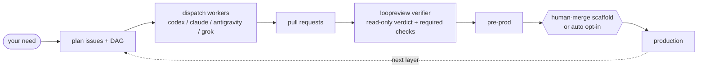

<div align="center">

# loopcoder

**Turn a delivery need into reviewed pull requests -- without leaving the chat.**

[](CHANGELOG.md)
[](LICENSE)
[](SKILL.md)
[](docs/specs/0884-macos-arm64-only.md)

[What it is](#what-it-is) | [v0.9 quickstart](#v09-ordinary-development-quickstart) | [The loop](#the-loop) | [Install](#install) | [Usage](#usage) | [Upgrade](#upgrade-from-070-080-to-081) | [How it works](#how-it-works) | [Design](#design)

</div>

## v0.9 ordinary development quickstart

For **v0.9.0** on Darwin arm64, start here (full detail:
[`docs/reference/v0.9.0-quickstart.md`](docs/reference/v0.9.0-quickstart.md),
capability matrix:
[`docs/reference/v0.9.0-capability-matrix.md`](docs/reference/v0.9.0-capability-matrix.md)):

```bash
loopcoder doctor
loopcoder doctor --format json   # codes/remediation aligned with capmatrix
```

Ordinary development uses isolated worktrees/PRs and a **human merge gate**. Do
**not** run `loopcoder compile`, `dispatch`, or `tick` against this repository
(self-bootstrap is unsupported). Prefer explicit direct run / bounded workflow,
global/project stores (no production `<repo>/.loopcoder` runtime writes), and
terminal GitHub rehydration for cross-Mac handoff.

## What it is

loopcoder is a local delivery-loop toolkit. Its intended workflow turns a need
into GitHub issues, provider-backed work in isolated git worktrees, pull
requests, independent review, and gated promotion. The v0.8.1 binary connects
the product paths that were incomplete in v0.8.0 (routing, nested permissions,
waiters, progress hosts, installer PATH, and release evidence harnesses).

It removes the copy-paste churn of AI coding: ask the model, paste issues into GitHub, run an agent, review the diff, repeat. With loopcoder that loop runs from the conversation. One chat. No window-switching. New scaffolds write `adapters.gate: human-merge` so humans choose production merges explicitly; legacy empty or missing gate configs still normalize to `auto` at runtime for compatibility. Repo-facing artifacts and worker summaries are written in English.

v0.8.1 is the current release line for native macOS Apple Silicon
(`darwin/arm64`) only. Fixture and packaged product-path gates pass on the
candidate; live Codex/Claude canaries remain owner-gated for product-path Full
GO. Live Apple Developer ID + notarize is recommended for Gatekeeper-friendly
public downloads and is optional for product-path GO. See the
[`v0.8.1 release runbook`](docs/reference/v0.8.1-release-runbook.md),
[`capability matrix`](docs/reference/v0.8.0-capability-matrix.md), and
[host progress visibility contracts](docs/reference/progress-hosts.md).

## The loop



This diagram is the intended loop. In v0.8.1, unpinned workers route through
`route decide` before launch; verifiers route independently via `loopreview`.
`codex`, `claude`, `grok`, and `antigravity` have registered Worker adapters
with different evidence and permission limits. The older direct `gemini`
adapter remains experimental. At runtime, an empty or missing production gate
normalizes to `auto` for legacy compatibility. New `loopcoder init --repo .`
scaffolds write `adapters.gate: human-merge`; pass `--gate auto` or edit
`.delivery.yml` only after reviewing the capability matrix and the
repository's own gates.

## What it looks like

Illustrative:

```text
you   > /loopcoder add a /healthz endpoint and a test, behind a feature flag
loop  > plan: #41 endpoint, #42 test (blocked-by #41). dispatch the ready set? [y]
loop  > #41 -> worktree -> codex -> PR #43   checks green   verdict: pass
loop  > #41 merged; #42 ready -> PR #44   verdict: pass
loop  > done. 2 PRs promoted, 0 blocked.
```

## Install

Install the public **v0.8.1** release on native macOS Apple Silicon
(`darwin/arm64`) with the no-Go shell installer:

```bash
curl -fsSL https://raw.githubusercontent.com/jasonhnd/loopcoder/main/scripts/install.sh | sh -s -- --version 0.8.1
```

Custom install directory (PATH, profile lines, and printed instructions all use
the same directory; re-runs are idempotent):

```bash
LOOPCODER_INSTALL_DIR="$HOME/tools/loopcoder" \
  curl -fsSL https://raw.githubusercontent.com/jasonhnd/loopcoder/main/scripts/install.sh | sh -s -- --version 0.8.1
```

Guidance only (do not edit shell profiles):

```bash
LOOPCODER_NO_MODIFY_PATH=1 \
  curl -fsSL https://raw.githubusercontent.com/jasonhnd/loopcoder/main/scripts/install.sh | sh -s -- --version 0.8.1
```

Windows, Linux, WSL, containers, and Intel macOS are **not** supported by the
v0.8 installer. Users who need those hosts should remain on the historical
**v0.7.0** release.

Or install with Go on the supported host:

```bash
go install github.com/jasonhnd/loopcoder/cmd/loopcoder@v0.8.1
```

Then confirm the binary:

```bash
loopcoder version   # expect platform=darwin/arm64
loopcoder doctor
```

For a first consumer repository, follow the [`Quickstart (new project)`](docs/reference/usage.md#quickstart-new-project): install once, run `loopcoder version`, run `loopcoder init --repo .`, install the playbook and project conductor hooks with `loopcoder skill install --repo .`, run `loopcoder projects register --repo .`, run `loopcoder doctor --repo .`, run `loopcoder report --repo .`, then drive dispatch, `tick`, and `loopreview` through `/loopcoder <your need>`.

Prerequisites on `PATH`: `git`, authenticated `gh`, and at least one registered
provider CLI. The release installer verifies the Sigstore-signed `SHA256SUMS`
before trusting checksums (cosign on the script path). That proves **archive
integrity and release provenance**. Apple Developer ID + notarize is
**optional** for product-path GO; when the published Mach-O is not notarized,
prefer the installer + Sigstore path or `go install` rather than expecting
Gatekeeper to treat a browser download like a notarized desktop app.
`codex` is the default worker, `claude` is the usual independent verifier,
`antigravity` uses executable `agy`, and the direct `gemini` adapter is
experimental/unverified. Provider registration is not proof of authentication,
usable capacity, safe role support, or exact-release real-provider evidence;
consult the capability matrix before unattended dispatch.

**v0.8.1 support is native macOS Apple Silicon only (`darwin/arm64`).** See
[`docs/reference/usage.md`](docs/reference/usage.md) for setup and end-to-end
usage. loopcoder is also usable as a Claude Code skill; point the `loopcoder`
skill at this repo.

## Upgrade From 0.7.0 / 0.8.0 To 0.8.1

On native macOS Apple Silicon, upgrade the binary, inspect the storage plan before running any stateful v0.8 command, apply it explicitly, then refresh each project's hooks and run doctor:

```text
loopcoder upgrade --version 0.8.1
loopcoder version
loopcoder migrate storage --format json
loopcoder migrate storage --apply --format json
loopcoder skill install --repo .
loopcoder projects register --repo .
loopcoder migrate local-state --repo . --dry-run
loopcoder doctor --repo .
```

`loopcoder upgrade --version 0.8.1` selects only the signed Darwin arm64 archive and swaps the machine-level binary atomically. `migrate storage` is plan-only unless `--apply` is present; the apply path verifies an owner-only schema-9 backup, then migrates schema 9 through 30 atomically. Stop all LoopCoder processes before migration or rollback. Each project must still run `loopcoder skill install --repo <repo>` to refresh project hook settings and local `.git/info/exclude` protection. `projects register` records the checkout in the machine-local registry, while `migrate local-state --dry-run` previews older repo-local `.loopcoder/` imports. See [storage migration](docs/reference/storage-migration.md) for interruption, backup, and offline rollback rules.

Windows, Linux/Ubuntu, WSL, containers used as a LoopCoder runtime, Intel macOS, and Rosetta/amd64 macOS are unsupported in v0.8.0. Those users should remain on the final legacy multi-platform release, v0.7.0, or contribute to a separately approved future platform roadmap. Re-running the v0.8.0 upgrade reports the selected version as already latest.

## Usage

The commands below are the v0.8.0 command inventory, not a blanket production
support statement. In particular, automatic routing, routed Verifier
independence, real-provider nested execution, quota-reset waiting, and
unsolicited live progress are not supported product paths in v0.8.0. Use the
[`capability matrix`](docs/reference/v0.8.0-capability-matrix.md) to select only
supported or explicitly human-controlled canary paths.

- In a conductor session: `/loopcoder <your need>` -- the playbook coordinates
  the available commands and keeps the human merge gate. Do not infer support
  for a product path merely because a command or internal contract exists.
- The mechanical layer is the `loopcoder` binary. The conductor calls it; you can too. The stable command inventory below matches v0.8.0:

```bash
loopcoder version                             # print version and build information
loopcoder models                              # list provider model/depth registry
loopcoder models --provider antigravity       # list agy-backed model choices
loopcoder providers refresh --repo .          # refresh bounded provider CLI installation inventory
loopcoder budget smoke --repo . --project-id <project-id> --format json # exercise local quota usage budget accounting
loopcoder audit --repo . --layer sast         # run read-only security audit
loopcoder doctor --repo .                     # read-only readiness and migration report
loopcoder doctor --repo . --format json       # machine-readable readiness report
loopcoder doctor --repo . --fix               # explicit local repair/cleanup mode
loopcoder init --repo .                       # scaffold first-run repo files with human-merge gate
loopcoder init --repo . --gate auto           # explicitly opt into automatic production promotion
loopcoder skill install --repo .              # install global skill and project hooks
loopcoder discover --repo .                   # advanced: discover CI failures and file issues
loopcoder compile --repo .                    # advanced: compile ROADMAP.md into issues
loopcoder ready-set     --repo .              # classify ready vs blocked work
loopcoder delivery plan --project-id <id> --run-id <id> --format json # side-effect-free v0.8 DeliveryRun proposal
loopcoder delivery decide --project-id <id> --run-id <id> --action approve --expected-authorization-fingerprint <sha256:...>
loopcoder delivery continue --project-id <id> --run-id <id> --expected-authorization-fingerprint <sha256:...>
loopcoder wait quota-reset --until <RFC3339>  # provider-free local wait for a known quota reset
loopcoder tick          --repo .              # run one unattended delivery pass
loopcoder trigger goal-loop --repo .          # advanced: run an automation trigger
loopcoder promote      --repo .               # may change production branch when gates pass
loopcoder upgrade --version 0.8.1             # signed Darwin arm64 self-upgrade
loopcoder dispatch-wave --repo .              # dispatch the current ready wave
loopcoder dispatch      --repo . --issue-number 41 --issue-title "Add /healthz endpoint" --provider claude --strict
loopcoder dispatch      --repo . --issue-number 41 --issue-title "Add /healthz endpoint" --foreground
loopcoder dispatch      --repo . --issue-number 41 --issue-title "Add /healthz endpoint" --detach
loopcoder relay list    --repo .              # inspect pending local relay blocks
loopcoder relay flush   --repo .              # print pending relay blocks verbatim and clear them
loopcoder resume        --repo .              # reconcile a run after an interruption
loopcoder status        --repo .              # render local-only run status
loopcoder run           --repo . --issue N --provider P --model M  # primary direct-path shell (explicit route; no auto-route until P4)
loopcoder events        --repo .              # follow/list report events (thin surface)
loopcoder attach        --repo . --run <run-id> # follow durable detached run progress
loopcoder cancel        --repo . --run <run-id> # request detached run cancellation
loopcoder report        --repo .              # list recent local reporter records
loopcoder report --repo . --format json       # list reports plus records/source/run/path context
loopcoder state push    --repo . --run-id <id> # explicitly publish summaries to the state branch
loopcoder state pull    --repo .              # pull state branch summaries
loopcoder lease acquire --repo . --run-id <id> # acquire conductor lease
loopcoder lease release --repo . --run-id <id> # release conductor lease
loopcoder recover       --repo . --issue-number 41 --issue-title "Add /healthz endpoint" --run-id <id>
loopcoder loopreview    --repo . --pr-number 43 --provider claude --strict
loopcoder verify-local  --repo . --pr-number 43
loopcoder dispatch-wave --repo . --issue-numbers 41,42 --foreground
loopcoder hook conductor-reporter             # internal: host hook integration
loopcoder ps --repo .                         # list loopcoder-managed worker processes
loopcoder kill --repo . --run <run-id>        # terminate loopcoder-managed processes for one run
loopcoder kill --repo . --all                 # terminate all loopcoder-managed processes for this repo
loopcoder attest        --role conductor --provider codex-cli --model gpt-5 --permission orchestrate --action "dispatch issue #41" --duration-ms 120000 --total-tokens 12345
```

The v0.8.1 candidate additionally exposes routing as an explicit, provider-
neutral operation. These commands do not launch a provider or change the
legacy unpinned `dispatch` default:

```bash
loopcoder route explain --project-id <id> --run-id <id> --task-requirement-id <id> --decision-key <key> --format json
loopcoder route decide --project-id <id> --run-id <id> --task-requirement-id <id> --decision-key <key> --format json
```

Machine-local registry and migration commands retained from v0.7.0 include:

```bash
loopcoder projects register --repo .          # add or refresh this checkout in the global project registry
loopcoder projects list --format json         # list registered projects for machine use
loopcoder projects show --repo .              # inspect this checkout's resolved registry identity
loopcoder projects remove --repo .            # detach active registry entry while preserving history
loopcoder migrate local-state --repo . --dry-run
loopcoder migrate local-state --repo .        # copy legacy .loopcoder records into local storage
loopcoder nested run --repo . --plan child-plan.json --provider codex # execute a validated child plan
loopcoder status --repo . --format json       # inspect latest run tree as stable JSON
loopcoder report --repo . --run <id> --format json # include run_tree in JSON
```

Host-profiled non-interactive `dispatch`, `dispatch-wave`, and `tick` launches default to detached supervision and immediately return the run id plus `status`, `attach`, and `cancel` commands; pass `--foreground` for synchronous local execution. Foreground `dispatch` and `loopreview` emit local-only human-readable report receipts to stderr by default, while foreground `dispatch-wave` streams each Worker receipt to stdout as that Worker completes and still prints the aggregate wave report. Receipts are conclusion-first and use the stable section order `Target`, `Verdict`, `Review summary`, `Run`, and `Next`; verifier receipts include verdict, finding counts, and needs-human reasons. The durable local machine surfaces are the `[reporter]` header, canonical report JSON, the `dispatch` / `loopreview` result JSON, and gitignored `.loopcoder/` run records, not PR bodies or merge artifacts. Use `--pretty` to force emoji output and `--no-pretty` to suppress the display. `loopcoder attest` remains a compatibility alias for direct Conductor self-reports.

### Model And Depth

`loopcoder models` prints the static provider registry without reading `.delivery.yml`, calling provider CLIs, or requiring provider authentication:

```text
loopcoder models
loopcoder models --provider codex
loopcoder models --provider claude
loopcoder models --provider antigravity
loopcoder models --provider grok
loopcoder providers refresh --repo .
```

Initial registry defaults:

| Provider | CLI | Default model | Default depth |
| --- | --- | --- | --- |
| `codex` | `codex` | `gpt-5.5` | `high` |
| `claude` | `claude` | `claude-opus-4-8[1m]` | `max` |
| `antigravity` | `agy` | `Gemini 3.1 Pro` | `High` |
| `grok` | `grok` | provider dynamic inventory | provider default |

Worker and Verifier model selection is role-scoped. For each role, provider resolves from command flags, then `.delivery.yml`, then built-in role fallback. Model resolves from command flags, then `worker.model` / `verifier.model`, then the selected provider's registry default. Depth resolves from command `--effort`, then `worker.reasoning_effort` / `verifier.reasoning_effort`, then the selected model's default depth.

Configured model and depth values are exact and case-sensitive. Invalid selections warn by default and preserve the pass-through value for compatibility. Enable hard rejection with:

```yaml
models:
  strict: true
```

or pass `--strict` to commands that resolve Worker or Verifier model/depth selections, including `dispatch`, `dispatch-wave`, `loopreview`, `audit`, `tick`, `trigger`, and `recover`.

### Antigravity

The provider key is `antigravity`; the executable is `agy`.

```text
agy login
agy models
loopcoder models --provider antigravity
loopcoder providers refresh --repo .
loopcoder doctor --repo .
```

When configured as a Worker provider, loopcoder invokes:

```text
agy -p <prompt> --add-dir <worktree> --model "<model> (<Depth>)"
```

The mandatory `--add-dir` pins Antigravity to the worker worktree. Antigravity Worker reports use the selected model string, such as `Gemini 3.1 Pro (High)`, as `model_source: self-reported` and accept absent token usage because `agy` does not expose stable parseable usage in this path. Antigravity read-only mode is not available or verified, so `loopreview` and audit-review selections fail closed instead of launching a mutating review.

### Doctor And Migration Preview

The current v0.8.0 `loopcoder doctor --repo .` is a read-only operational
health command for git, gh auth, `.delivery.yml`, provider CLIs, selected
binary version, reporter/relay wiring, installed skill freshness, audit
readiness, local-state exclude protection, tracked `.loopcoder/` files,
reportquery readability, and stale local state counts.

It includes resolved host profile, provider/host compatibility, storage
permissions and health, project registry identity, migration status, provider
inventory and quota evidence, and durable run health. `--format json` emits
`repo_path`, `version`, `commit`, `date`, `exit_code`, a root `host_profile`
object, `provider_compatibility[]` entries for the smoke matrix, a root
`provider_inventory` object, and ordered `checks[]` objects with `name`,
`code`, `status`, `hard`, `message`, and `fix_command`.

`loopcoder providers refresh --repo .` runs the same bounded provider CLI
installation and auth-readiness probes and persists machine-local
ProviderInstallation, ProbeResult, AccountProfile, and AuthReadiness history in
`$LOOPCODER_HOME/data/loopcoder.db`. Probes use fixed argv arrays, an explicit
non-credential environment allowlist, strict time/output caps, redacted
provider output, and no shell interpolation.
The allowlist includes location and platform variables needed by script shims
such as `LOCALAPPDATA`, `APPDATA`, `ProgramFiles`, `SystemRoot`, `ComSpec`,
`PSModulePath`, `PATH`, `PATHEXT`, `TEMP`, `TMP`, `HOME`, `USERPROFILE`,
`TMPDIR`, `LANG`, and `LC_ALL`; any variable name containing `key`, `secret`,
`token`, `password`, `credential`, or `auth` is still denied even if listed.
Installation evidence is not auth readiness, account readiness, model
authorization, quota, or usable capacity; human and JSON output keep
`usable_for_invocation` as `unknown` from install evidence alone. Unsupported
auth readiness returns `unknown` with a reason. Unsupported quota telemetry
returns an immutable QuotaSnapshot with unavailable confidence, unknown reset
semantics, and explicit `unsupported-source` / `not-collected` gap reasons
instead of guessing capacity. Built-in local declarations use `codex login
status`, `claude auth status --json`, and Gemini auth-reference existence checks
without reading credential values or files. Network-declared auth and quota
probes, including Antigravity's `agy models`, are recorded but not executed by
default; their readiness or telemetry is `unknown`/`unavailable` with
`network-permission-denied` or `network-denied`. The initial auth schema
intentionally has no `expires_at` field because no current adapter exposes a
credential-blind machine-readable expiry value.

### Budget Accounting

`loopcoder budget smoke --repo . --project-id <project-id> --ceiling 100 --reserve 40 --commit 25 --format json` runs a local-only reserve/commit/release smoke check against the machine-local budget store. It creates machine and project hard budget policies by default, reserves capacity, commits observed usage, releases the unused reservation balance, and prints the resulting JSON accounting summary. Use `--policy-mode soft --overflow-behavior warn-only` to exercise soft-budget warning paths; text output prints budget warnings, and JSON output includes the same `gap_reasons`. Reusing the same `--idempotency-key` replays the same operation keys instead of reserving, committing, or releasing twice. Budget accounting is local evidence only and is not a permission, safety, provider-auth, or provider-global quota override.

### Project Registry

`loopcoder projects` manages the machine-local project registry in `$LOOPCODER_HOME/data/loopcoder.db`. On the supported Darwin arm64 host, LoopCoder creates and tightens `$LOOPCODER_HOME` and `data/` to owner-only directory permissions and the SQLite database plus `-wal`/`-shm` sidecars to owner-only file permissions. Existing broader modes are reported by `doctor` and repaired by `doctor --fix`; symlink and non-regular storage paths are refused. Registration is idempotent and uses the strongest available identity: normalized GitHub owner/name, then normalized git remote URL, then canonical local path. Display name is metadata only, so two repositories with the same folder name but different remotes remain separate projects. Git remote URLs are sanitized before output or persistence; LoopCoder never stores URL credentials, tokens, credential-like query strings, or fragments in project metadata.

```text
loopcoder projects register --repo .
loopcoder projects list
loopcoder projects list --format json
loopcoder projects show --repo .
loopcoder projects show --repo . --format json
loopcoder projects remove --repo .
```

`list` shows active projects. `show --repo .` also works for an unregistered checkout and reports the candidate project ID and identity source; for a detached checkout it reports the preserved project identity with `detached: true`. `remove --repo .` detaches the active registry entry by setting `detached_at`; it does not delete the project row, runs, run events, run edges, reports, legacy import records, import status, or file payloads. Re-running `register --repo .` for the same identity reactivates the preserved project row and reconnects the existing history. After registration, new attempts, events, reports, relay records, recovery briefs, lifecycle records, logs, and temporary worker scratch space are written under `$LOOPCODER_HOME/projects/<project_id>/`, `$LOOPCODER_HOME/logs/`, and `$LOOPCODER_HOME/tmp/` by default. Unregistered projects keep an explicit legacy fallback: worker scratch uses the OS temp directory and runtime records remain repo-local under `.loopcoder/` until the project is registered. `doctor --repo .` includes the selected project ID, payload root, fallback mode, migration state, and warnings when the current checkout's identity is ambiguous.

### Local State Migration

`loopcoder migrate local-state --repo .` explicitly imports v0.6.x repo-local `.loopcoder/` attempts, events, reports, recovery briefs, and relay records into `$LOOPCODER_HOME/data/loopcoder.db`. Use `--dry-run` first to report import candidates without registering the project or writing storage. The real migration registers or refreshes the project identity, stores source-path and hash metadata for imported records, and is safe to re-run without duplicating imported reports. Malformed JSON or JSONL records are reported with their source path and line when available, but valid records from the same migration continue importing.

The command copies local state into the machine-local store only. It does not delete `.loopcoder/`, rewrite local files, edit tracked repository files, mutate GitHub, or publish state. Existing file readers remain the compatibility fallback, and registered projects query global project history before repo-local legacy files. `loopcoder report --repo . --format json` includes imported records after migration.

Registered projects write new audit logs under `$LOOPCODER_HOME/projects/<project_id>/audit/`. Legacy audit logs remain file-only repo-local state: `migrate local-state` does not import `.loopcoder/audit/`, and an audit-only checkout does not require migration. Back up local runtime state by copying `$LOOPCODER_HOME/data/loopcoder.db` plus `$LOOPCODER_HOME/projects/`, `$LOOPCODER_HOME/logs/`, and `$LOOPCODER_HOME/tmp/` when present and no LoopCoder command is running. For a v0.8-to-v0.7 rollback, stop every LoopCoder process, copy the verified migration backup rather than moving it, restore the v0.7.0 binary, and understand that v0.8-only state is discarded. Never point v0.7.0 at a schema-30 database. The exact machine-readable limitation codes are documented in [storage migration](docs/reference/storage-migration.md).

`loopcoder doctor --repo . --fix` performs only explicit local repairs: tighten existing Unix storage permissions in place, migrate legacy `.delivery.yml attestation` keys to `report`, refresh conductor hook settings to `loopcoder hook conductor-reporter`, move legacy hook state from `conductor-attest` to `conductor-reporter`, rewrite eligible local state keys from `attestation` to `report`, and prune cleanup-eligible gitignored `.loopcoder/` state. It does not delete or recreate the SQLite database, install provider CLIs, run provider login, flush pending relay records, edit tracked docs, choose models, commit, push, or mutate GitHub.

The stale-state cleanup policy retains active runs, recent runs, the newest retained run directories, runs referenced by pending relay records, recent recovery briefs, pending relay obligations, recent and newest `.attest` ledgers, recent audit logs, audit logs referenced by current output, and recent worktree-liveness artifacts. Cleanup is bounded, skips symlinks, and refuses to remove paths outside the repo's `.loopcoder/` tree.

### Reporter Transition

Worker, Verifier, audit, and Conductor invocations now produce validated local-only reports with `[reporter]` headers and result JSON `report` objects. Reports cover role, provider, model, model source, effort/depth, permission, action, exit code, timing, token usage when available, and verification status. Default human output is a compact receipt without embedded raw JSON; `loopcoder report --repo . --verbose` shows the canonical record in text output, and `loopcoder report --repo . --format json` emits clean parseable JSON only. Machine consumers should parse stable headers, canonical JSON, or the nested `report` object.

During the 0.6.x transition window, readers accept legacy `[attestation]` headers, legacy result JSON `attestation` objects, the old `loopcoder hook conductor-attest` command, old `.delivery.yml attestation` keys, and old `LOOPCODER_CONDUCTOR_ATTEST_*` env vars. New output and writes use `[reporter]`, `report`, `report.channel`, `conductor-reporter`, and `LOOPCODER_CONDUCTOR_REPORTER_*`. Frozen local machinery stays frozen: `.loopcoder/relay/*.attest` keeps its extension and canonical report JSON field names are unchanged.

`loopcoder hook conductor-reporter` enforces the local Conductor self-report step before a delivery or merge turn can finish. `loopcoder hook conductor-relay-guard` prevents hidden Worker and Verifier report blocks from completing a turn. The relay hard gate blocks mechanical progress with exit code `4` while pending Worker/Verifier blocks are unacknowledged; `loopcoder relay flush --repo .` prints and clears them, and `loopcoder relay list --repo .` inspects them.

### loopreview exit codes and relay gate

`loopcoder loopreview` reserves process exit codes `0`, `1`, and `2` for clean verifier verdicts only, so CI can distinguish a review decision from a command failure:

- `0` means clean verifier verdict `pass`.
- `1` means clean verifier verdict `fail`.
- `2` means clean verifier verdict `needs-human`.
- `3` means the `loopreview` command itself failed before or after a clean verdict.
- `4` is reserved for the cross-command relay hard gate on mechanical progress commands.

## How it works

- Conductor: a configured agent session that coordinates available commands
  and keeps the final human gate.
- Worker: `loopcoder dispatch` can run one explicitly selected registered
  provider for one issue in a fresh git worktree, then open a PR. On the
  v0.8.1 candidate, unpinned Worker dispatch persists a route decision before
  launch and uses that selection as the only provider/model/effort authority;
  explicit `--provider` is a durable pin. Frozen v0.8.0 still defaults unpinned
  dispatch directly to Codex.
- Nested orchestration: `loopcoder nested run --plan <file.json>` persists and
  schedules bounded child-plan records. The read-only executor supports Codex,
  Claude, and Grok through explicit provider read-only modes, then compares a
  durable pre-run repository/project-state baseline with the post-run state.
  Existing user dirt is preserved as baseline; any tracked, untracked, index,
  ref, config, hook, linked-worktree, or guarded LoopCoder-state change becomes
  a typed `needs-human` policy violation and is never remediated automatically.
  Bounded write is registered only for Codex and Grok and is verified in an
  isolated detached worktree. Orchestrate, provider-native, and unregistered
  provider/host routes are refused before persistence, claim, or provider
  launch. Provider feature advertising is inventory evidence, not delegation
  authority. The reserved `test-subprocess` provider is deterministic test
  infrastructure and passes through the same enforcement.
- Verifier: `loopcoder loopreview` returns a structured `pass`, `fail`, or
  `needs-human` verdict. Codex and Claude have historical mechanism smoke
  evidence, not protected exact-v0.8.0 canaries; provider independence is
  advisory rather than router-enforced. Antigravity fails closed for read-only
  review.
- Gate: clean `tick` PRs can auto-merge only into the configured pre-prod branch after `loopreview = pass`, green required checks, and a deterministic red-line risk gate. The separate `promote` step follows `adapters.gate`: `gate: auto` auto-promotes to production only when CI is green, `loopreview` passed, configured evidence is present, and the red-line floor is clean; `gate: human-merge` requires an explicit human-directed production merge.
- Ports and adapters: GitHub work items, git-worktree workspace, configured conductor, provider-pluggable worker, GitHub PRs and checks, independent verifier, pre-prod risk gate, and production promotion gate. `.delivery.yml adapters` names the role slots, including `conductor`, `worker`, `verifier`, and `gate`.
- Doc-first: a design or spec document merges before any code implements it. See [`docs/PROCESS.md`](docs/PROCESS.md).
- Provider-neutral contracts: Codex, Claude, Antigravity, and Grok share
  adapter and evidence schemas. v0.8.0 does not yet connect every provider to
  the same routed, permission-safe, release-gated product path.

## Why loopcoder

- Production promotion supports `auto`, with a deterministic conjunctive gate and production rollback to the recorded prior-stable SHA. New scaffolds default to `human-merge`; existing gate-less configs keep the legacy `auto` runtime behavior.
- Isolated git worktrees -- parallel workers do not collide; conflicts are handled at merge time.
- Doc-first -- code implements a merged design, and review checks conformance to it.
- Model/depth registry -- operators can discover exact model and depth tokens, validate selections, and keep Worker and Verifier choices independent.
- Antigravity Worker path -- Gemini-family work runs through Google Antigravity `agy` with an explicit worktree pin.
- Verification gate wiring -- required CI checks must be green before a PR is merge-eligible; `loopreview` adds read-only verifier output and a timeout-to-`needs-human` safety net.
- Audit -- `loopcoder audit` provides a read-only security audit with a deterministic SAST floor for CI and an optional read-only LLM review lens for local adversarial analysis. See [`docs/reference/audit.md`](docs/reference/audit.md).
- Reporter -- worker and verifier invocations produce validated local-only reports. PR bodies, merge commits, and merge comments do not carry `[reporter]` headers or canonical JSON.
- Durable local mechanics -- non-interactive dispatch defaults to detached
  supervision, progress receipts are durable, and process authority is
  persisted. Only the local CI waiter is connected as a supported waiter;
  other waiter and live-delivery paths remain incomplete.
- Doctor, migration, and upgrade -- v0.8.0 has Sigstore-verified archive
  checksums, side-effect-free migration planning, a verified schema-9 backup,
  atomic schema-30 application, project registry diagnostics, and explicit
  repair guidance. It does not have Apple Developer ID or notarization trust.
- Native Darwin arm64 binary -- `go install` or the signed release archive; no runtime dependency beyond `git`, `gh`, and the selected provider CLIs.

## Design

- [`docs/README.md`](docs/README.md) -- document type legend and docs index.
- [`docs/PROCESS.md`](docs/PROCESS.md) -- mandatory doc-first workflow.
- [`docs/reference/architecture.md`](docs/reference/architecture.md) -- current architecture and limits.
- [`docs/reference/v0.8.0-capability-matrix.md`](docs/reference/v0.8.0-capability-matrix.md) -- binding v0.8.0 capability, evidence, and production-support status.
- [`docs/reference/audit.md`](docs/reference/audit.md) -- read-only security audit command.
- [`docs/reference/releasing.md`](docs/reference/releasing.md) -- release documentation rule.
- [`docs/reference/self-bootstrap.md`](docs/reference/self-bootstrap.md) -- v0.8.0 self-bootstrap acceptance checklist.
- [`docs/reference/storage-migration.md`](docs/reference/storage-migration.md) -- v0.7-to-v0.8 SQLite planning, verified backup, and offline rollback contract.
- [`docs/reference/v0.8.0-go-no-go.md`](docs/reference/v0.8.0-go-no-go.md) -- v0.8.0 release evidence template and decision record.
- [`docs/reference/v0.7.0-go-no-go.md`](docs/reference/v0.7.0-go-no-go.md) -- v0.7.0 release go/no-go report.
- [`docs/reference/usage.md`](docs/reference/usage.md) -- setup and end-to-end usage.
- [`docs/specs/0028-scheduling.md`](docs/specs/0028-scheduling.md) -- dependency-aware scheduling.
- [`docs/specs/0039-verification.md`](docs/specs/0039-verification.md) -- required checks and verifier verdicts.
- [`docs/specs/0041-resilience.md`](docs/specs/0041-resilience.md) -- worker state, resume, recovery, and retry.
- [`docs/specs/0089-go-migration.md`](docs/specs/0089-go-migration.md) -- native Go backend migration.
- [`docs/specs/0554-model-depth-selection.md`](docs/specs/0554-model-depth-selection.md) -- model registry, depth validation, and Antigravity provider.
- [`docs/specs/0567-reporter.md`](docs/specs/0567-reporter.md) -- live reporter rename and transition rules.
- [`docs/specs/0583-upgrade-migration-doctor.md`](docs/specs/0583-upgrade-migration-doctor.md) -- 0.6.0 upgrade, migration, doctor, and release-docs rule.
- [`docs/specs/0146-attestation.md`](docs/specs/0146-attestation.md) -- historical foundation for per-invocation Worker, Verifier, and Conductor reports.
- [`docs/learnings.md`](docs/learnings.md) -- append-only operational learnings.
- [`CHANGELOG.md`](CHANGELOG.md) -- release history.

## What's new in v0.8.1

Compared with v0.8.0 (contracts without full product wiring):

| Path | v0.8.1 |
| --- | --- |
| Unpinned Worker `dispatch` | Persists route decision, then launches selected provider |
| Independent `loopreview` | Verifier route + independence policy |
| DeliveryRun | `claim-dispatch` for one ready task |
| Nested children | Permission-safe route before claim/launch; live Codex/Claude canaries pass |
| Provider failure | Typed classification → bounded fallback wiring |
| Wait | Provider-free `approval` / `outbox` / `detached-worker` / `quota-reset` |
| Progress hosts | Codex / Claude / Paseo / generic contracts |
| Installer | `LOOPCODER_INSTALL_DIR` honored for PATH/profile/instructions |
| Release | Canaries + product-path go/no-go gate; Apple live optional |

Full narrative: [`.github/release-notes/v0.8.1.md`](.github/release-notes/v0.8.1.md) and
[`CHANGELOG.md`](CHANGELOG.md).

## Status

v0.8.1 is the current release line for native macOS Apple Silicon only. Product
paths for routing, nested permissions, waiters, progress hosts, installer PATH,
and release evidence harnesses are connected. Fixture and packaged go/no-go
gates pass; **product-path Full GO** requires owner-run live Codex/Claude
canaries against the freeze digest. Live Apple Developer ID + notarize is
optional (recommended for Gatekeeper-friendly public downloads). See the
[`v0.8.1 release runbook`](docs/reference/v0.8.1-release-runbook.md),
[`v0.8.1 go/no-go gate`](docs/reference/v0.8.1-go-no-go.md),
[`capability matrix`](docs/reference/v0.8.0-capability-matrix.md), and
[host progress visibility contracts](docs/reference/progress-hosts.md). The
repository keeps `gate: human-merge` for LoopCoder-core safety.

v0.7.0 remains available as the final legacy multi-platform release. v0.8.0
remains the prior Darwin arm64 public tag. Historical
[`v0.8.0`](docs/reference/v0.8.0-go-no-go.md) and
[`v0.7.0`](docs/reference/v0.7.0-go-no-go.md) go/no-go records are preserved.

## License

[MIT](LICENSE)
